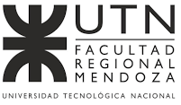

# SonoTraining

This development is powered by CONICET-Argentina, Universidad de Mendoza-Argentina and Universidad Tecnológica Nacional - Facultad Regional Mendoza.

   

## Description

## Installation

# How to contribute to the software 

All help is welcomed and needed!
If you want to contribute contact us at sonounoteam@gmail.com

# Report issues or problems with the software

All people could report a problem opening an issue here on GitHub or contact us by email: sonounoteam@gmail.com
