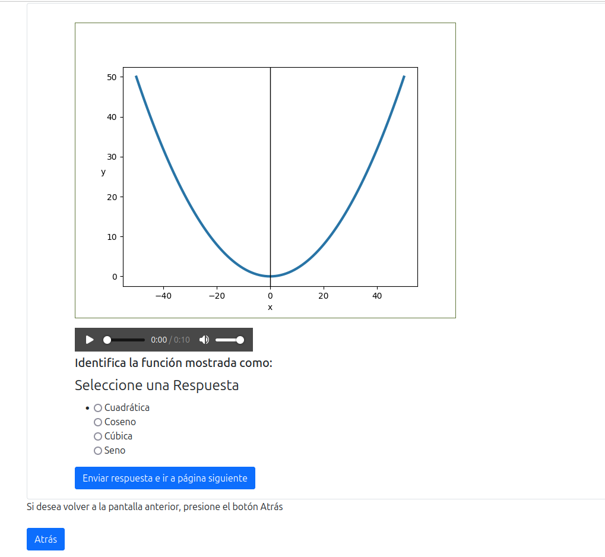
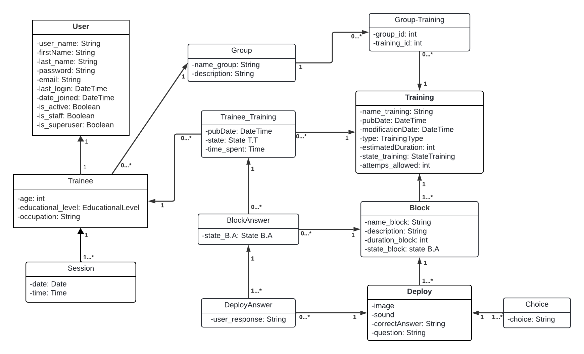

# Summary

The natural world's comprehension is often hindered by a predominant reliance on visual learning styles, creating a gap between conventional and unconventional teaching methods. This emphasis on visual modalities limits understanding for those who struggle with visual information. To address this, a multi-sensory approach that integrates all senses is crucial. Sonification emerges as a powerful tool to enhance learning and accessibility, demonstrated by software like sonoUno, xSonify, and StarSound. However, effective implementation of sonification requires systematic training, leading to the development of sonoTrainings, a web platform built on Django for sonification training. The platform's design, inspired by PsychoPy desktop trainings, includes a database to manage training data and user information. Future implementation in courses will evaluate the platform’s accessibility and usability, aiming to optimize sonification training for diverse scientific fields.

# Introduction

Understanding the natural world is influenced by learning styles that favor vision. This situation generates a division in teaching techniques, making a significant distance between conventional and unconventional methods that address diverse needs.

Conventional teaching relies heavily on the presentation of visual information, which limits comprehension for those who struggle to process this type of information. In the field of research, this trend intensifies leaving aside other senses to a complementary role. An example of this are sound alerts that indicate the end of a data analysis process. Haptic complements, such as the vibration of a mobile phone when pressing keys or receiving messages, are also limited to everyday objects. 

The overemphasis on visual modalities in education and scientific research restricts a holistic perception of the natural world. Embracing a multi-sensory approach that meaningfully integrates all senses is crucial to enhance comprehension and information analysis for all individuals, fostering a cohesive understanding of the natural world. This is the driving force behind the sonoUno team’s endeavors.

On the way to achieving this, sonification emerges as a powerful tool to expand learning opportunities and accessibility. Software such as sonoUno\footnote{\url{https://www.sonouno.org.ar/}}, xSonify\footnote{\url{https://sourceforge.net/projects/xsonify/}}, and StarSound\footnote{\url{https://www.jeffreyhannam.com/starsound/}}, among others, demonstrate the potential of this form of data representation. Backing this notion there are research studies such as @wanda2011 and @foran2022, which showcase the effectiveness of these tools in the interpretation of astronomical data.

Like any other new technique, sonification requires a process of teaching and training. For this reason, training tests were developed using tools such as PsychoPy\footnote{\url{https://www.psychopy.org/}} [@bertainaA2022]. This tool, intended for use in experiments in Python, is mainly used in behavioral sciences. Its desktop application is free and, due to its versatility,  it was a viable option for designing the first set of training exercises. Its disadventage came with the web implementation. For running the same desktop-designed training exercises, a library called PJs was needed, which is not open source and does not allow to use files outside of the page offered by the PsychoPy project. To overcome these limitations, a new web platform, named sonoTrainings was specifically designed to host sonification training [@bertainaB2023; @bertainaA2023].

@fusco2015 employed tactile graphs as a multisensory learning technique, enabling the representation of diverse STEM educational resources for visually impaired students. Integrating sound with these tactile representations could further enhance multisensory learning.

The utilization of tactile graphs and sound integration, as proposed for visually impaired individuals, can be extended to create a preparatory course for sighted individuals. This approach aims to facilitate data analysis from various sources by incorporating not only the sense of sight but also hearing and touch.

# Statement of need

Data sonification has emerged as an innovative technique that complements data exploration and analysis in diverse cultural fields. While its popularity is growing, the training required for its effective use in the case of scientific data is still in the early stages of development.

Pioneering research in the field of astronomy has focused on assessing the effectiveness of sonification for data analysis. Studies like @tucker2022 and @trayford2023 have evaluated participants’abilities to identify variations in light curves and emission line properties using sonification tools like Astronify and STRAUSS. The findings consistently demonstrated the successful detection of signals in sonified data.

While these initial studies lay the groundwork for the application of sonification tests in astronomy for its subsequent use as a data analysis tool, there is a clear need to develop systematic training to optimize the use of this technique. It is in this sense that the design of a sonification training program began, which was presented in 2022 as part of an international training course under the REINFORCE project [@bertainaB2023]. The attendees of this course were researchers and educators. Various improvements for future training were extracted from this course, most of which could not be implemented with the version of the PsychoPy tool at the time. In addition, it was in this course that the need for a web-based rather than a desktop-based training became evident. When installing the PsychoPy application, some personal computers had problems in the process, which led to the participants’ frustration and demotivation.Furthermore, in order to collect the data, users were required to send the csv file that collected their responses, which is not acceptable for this type of proposal. The solution to this was to use Pavlovia, the web service offered by the PsychoPy project. As the latter is not open source, its long-term implementation was not an option, which is why a custom-built design began.

# Web development

## Web

sonoTrainings is a web platform specifically designed to host and manage sonification training exercises. It serves on the Django framework\footnote{\url{https://www.djangoproject.com/}}, a high-level and open-source web development environment. Django offers extensive documentation, which is up-to-date with the latest version (v.5.0.5), and facilitates the creation of complex websites by programming most components in Python. It stands out for its effective Model-View-Template architecture and enables the implementation of applications within the projects, functioning as independent modules that connect with others. This packaging approach makes it easier to reuse these applications in other projects. The developed web platform implements two applications within the project: one dedicated exclusively to the configuration and deployment of training exercises, and another for user registration management.

The design of the sonoTrainings web platform’s training exercises drew inspiration from previous desktop training experiences developed using PsychoPy. In these desktop trainings, an image and sound were presented on the screen for a short duration, followed by a prompt asking participants to identify any detected signals. Each type of signal was presented in separate blocks, with brief intervals between blocks of different characteristics. Adapting this approach to the web platform, sonoTrainings divides each training session into at least two distinct blocks, each containing a group of signal presentations that share common characteristics.

The training deployment system is implemented using forms. This approach enables the recording of user responses in a database, ensuring that every training is completed. Each deployment constitutes a page of the form, allowing users to resume the training in case of interruptions. Previously provided responses are stored, and the system displays the pending deployments. To optimize the user experience, each page of the form presents a signal with its corresponding audio, image, and question (\autoref{fig:fig1}). This reduces the cognitive load and facilitates the comprehension of the material.

To ensure the readability of the forms by assistive technologies, the development of sonoTrainings adheres to the Web Content Accessibility Guidelines (WCAG\footnote{\url{https://www.w3.org/WAI/standards-guidelines/wcag/es}}), implementing the recommendations outlined therein. Additionally, functionalities from the Bootstrap framework\footnote{\url{https://getbootstrap.com/}} were integrated to enhance the fluidity, responsiveness, and overall user experience, catering to both users with or without assistive technologies.  

{height="50%"}

## Database

The data collected from the training plan is stored in a specially designed database. The architecture (\autoref{fig:fig2}) of this database facilitates the management of training data and sonoTrainings platform users, utilizing a relational model and implemented using the SQLite\footnote{\url{https://getbootstrap.com/}} database management system.

The sonoTrainings platform’s database structure comprises six primary entities:

  - Trainings: This entity stores the names of all available trainings on the platforms. It serves as a unique identifier for each training and facilitates assigning them to different user groups. A training can have multiple blocks.
  - Blocks: Each training is associated with multiple blocks, which provide descriptions of the expected content within the training’s deployments. Blocks serve as organizational units within a training. A block can belong to only one training.
  - Deploys: This entity stores all multimedia files and the question bank utilized in the training. Each deployment is associated with a specific block, ensuring that the corresponding multimedia and questions are presented together. A deployment is associated with a single block.
  - Users: This entity maintains information about registered users on the platform, including their name, age, email address, and password. It serves as a central repository for user data. A user can have multiple deployments answers.
  - Deploy Answer: This entity stores the responses submitted by users during the training. It links user responses to specific deployments, enabling the tracking and analysis of user performance. A deployment answer is associated with a single user and a single deployment.
  - Group: This entity manages user groups created by platform administrators. It facilitates the organization and management of users into distinct groups for training assignments and access control purposes. A group can have multiple users.

This database is used to support the functionalities of a) training storage and management, b) user registration and management, and c) recording user responses during training. It is a prototype that will allow for scalability and the handling of large amounts of data, with the ability to add new entities and relationships as required by the project. Another important factor for migrating the database to another management system is the security that SQLite does not provide. 

The entire website will be tested in the course on Multisensory Analysis of Scientific Data, which will be held between May and June 2024, and will consist of 8 weekly sessions [@casado2024].

# Conclusions

Data sonification is an innovative tool with great potential to complement and enrich data analysis in various fields of knowledge. However, its effective implementation requires systematic training to optimize the use of this technique, and sonoTrainings is the first step in this direction.

The development platform enables the implementation of training with sonified data from various fields of knowledge, transcending the scope of astronomy and opening up a range of possibilities for its application in multiple disciplines. In this way, sonoTrainings facilitates the creation of personalized training for a wide range of users who seek to incorporate sonification as a fundamental tool in their data analysis.

The implementation of sonoTrainings in a course will enable the evaluation of the platform’s accessibility and usability, as well as the adjustment and optimization of the developed training. Through the collection of statistical data on the learning achieved by users, valuable information can be obtained to understand how multisensory information is perceived by humans.

# References
